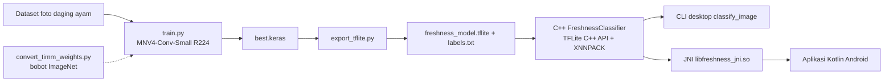

# CrossChick — Deteksi Kesegaran Daging Ayam (MobileNetV4-Conv-Small R224)

Pipeline lengkap untuk klasifikasi tingkat kesegaran daging ayam yang berjalan **100% offline** di Android:

| Bagian | Teknologi | Folder |
|---|---|---|
| Training model | TensorFlow 2.17 / Keras 3, MobileNetV4-Conv-Small, input 224×224 (R224) | [training/](training/) |
| Export model | TensorFlow Lite (`.tflite`: float32 / fp16 / int8) | [training/export_tflite.py](training/export_tflite.py) |
| AI inference native | C++17 + **TensorFlow Lite (LiteRT) C++ API** dari Google, akselerasi XNNPACK | [inference_cpp/](inference_cpp/) |
| Aplikasi mobile | Kotlin (Android Studio) + JNI ke library C++ | [android/](android/) |

> **Catatan tentang "TensorCore":** Google tidak punya library inference bernama *TensorCore* (Tensor Cores adalah unit hardware NVIDIA; Google Tensor adalah chip di Pixel). Runtime C++ resmi Google untuk inference offline di perangkat adalah **TensorFlow Lite**, yang sekarang bernama **LiteRT**. Project ini memakai TensorFlow Lite C++ API (`tflite::Interpreter`) yang dibangun langsung dari source resmi `github.com/tensorflow/tensorflow`.

## Alur Kerja



## Struktur Project

```
mobilenetv4_conv_small_crosschick_project/
├── training/                      # Python / TensorFlow
│   ├── config.py                  # konstanta (IMAGE_SIZE=224, normalisasi)
│   ├── mobilenetv4.py             # arsitektur MobileNetV4-Conv-Small (Keras)
│   ├── dataset.py                 # pipeline tf.data + augmentasi
│   ├── convert_timm_weights.py    # porting bobot ImageNet resmi (timm) -> Keras
│   ├── train.py                   # training 2 fase (head -> fine-tune)
│   ├── export_tflite.py           # konversi ke .tflite (+ kuantisasi)
│   └── evaluate.py                # classification report + confusion matrix
├── inference_cpp/                 # C++ inference (desktop & Android)
│   ├── include/crosschick/freshness_classifier.h
│   ├── src/freshness_classifier.cpp
│   ├── tools/classify_image.cpp   # CLI uji di PC
│   └── CMakeLists.txt
├── android/                       # Project Android Studio (Kotlin)
│   └── app/src/main/
│       ├── cpp/                   # JNI bridge + CMake (link ke inference_cpp)
│       ├── java/com/crosschick/freshness/
│       └── assets/                # freshness_model.tflite + labels.txt
├── scripts/                       # setup source TensorFlow, salin model
├── docs/                          # dokumentasi detail
└── third_party/tensorflow/        # (dibuat oleh script) source TensorFlow
```

## Quick Start

```powershell
# 1. Training environment
cd training
python -m venv .venv; .\.venv\Scripts\Activate.ps1
pip install -r requirements.txt

# 2. (Disarankan) bobot pretrained ImageNet
pip install -r requirements-convert.txt
python convert_timm_weights.py

# 3. Training
python train.py --data-dir ..\dataset --pretrained-weights weights\mnv4_conv_small_imagenet.weights.h5

# 4. Evaluasi & export
python evaluate.py --model outputs\best.keras --data-dir ..\dataset\test
python export_tflite.py --model outputs\best.keras --quant fp16 --data-dir ..\dataset\val

# 5. Source TensorFlow Lite untuk C++
cd ..
.\scripts\setup_tensorflow_source.ps1

# 6. (Opsional) uji C++ di PC
cmake -S inference_cpp -B build -DCMAKE_BUILD_TYPE=Release
cmake --build build --config Release --target classify_image -j 8
.\build\Release\classify_image.exe training\exported\freshness_mnv4s_r224_fp16.tflite training\exported\labels.txt contoh.jpg

# 7. Android
.\scripts\copy_model_to_android.ps1
# Buka folder android/ di Android Studio -> Sync -> Run
```

## Dokumentasi Detail

1. [docs/01_training.md](docs/01_training.md) — dataset, arsitektur, training, export TFLite, evaluasi
2. [docs/02_inference_cpp.md](docs/02_inference_cpp.md) — build TensorFlow Lite C++, API `FreshnessClassifier`, CLI
3. [docs/03_android.md](docs/03_android.md) — integrasi Kotlin + JNI, build APK, troubleshooting

## Kontrak Model (WAJIB konsisten)

| Item | Nilai |
|---|---|
| Input | `[1, 224, 224, 3]`, RGB, float32 **0..255** (uint8 bila int8) |
| Preprocessing di luar model | center-crop 1:1 → resize bilinear 224×224 |
| Normalisasi ImageNet | **di dalam model** (layer `Rescaling` + `Normalization`) |
| Output | `[1, N]` probabilitas softmax, urutan = `labels.txt` |

Jika aturan ini diubah di training, ubah juga [freshness_classifier.cpp](inference_cpp/src/freshness_classifier.cpp).
# crosschick_apps
Crosschick: Lightweight chicken freshness detection apps using AI Inference (Offline AI model) 
