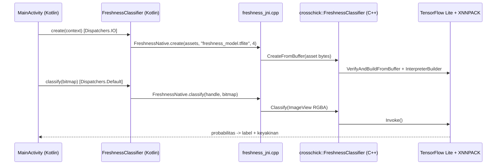

# 03 — Aplikasi Android (Kotlin + C++ JNI)

## 1. Prasyarat

- Android Studio Ladybug (2024.2) atau lebih baru
- SDK Platform 35, **NDK 27.0.12077973**, **CMake 3.22.1** (SDK Manager → SDK Tools)
- Source TensorFlow sudah ada di `third_party/tensorflow` (lihat [02_inference_cpp.md](02_inference_cpp.md))
- Model sudah diexport (lihat [01_training.md](01_training.md))

## 2. Menyiapkan Model

```powershell
.\scripts\copy_model_to_android.ps1 -Model training\exported\freshness_mnv4s_r224_fp16.tflite
```

Hasilnya:

```
android/app/src/main/assets/
├── freshness_model.tflite
└── labels.txt
```

`.tflite` tidak dikompresi di APK (`androidResources.noCompress`), sehingga dibaca cepat dari asset.

## 3. Build & Run

1. Android Studio → **Open** → pilih folder `android/`.
2. Tunggu Gradle Sync (Gradle 8.9, AGP 8.7). Bila diminta, izinkan Android Studio membuat Gradle wrapper.
3. **Run** ke perangkat arm64.

Build native pertama memakan waktu lama karena TensorFlow Lite ikut dikompilasi untuk Android; build berikutnya memakai cache (`app/.cxx`).

ABI default hanya `arm64-v8a` (hampir semua HP modern). Untuk emulator, tambahkan `"x86_64"` pada `abiFilters` di [app/build.gradle.kts](../android/app/build.gradle.kts).

## 4. Arsitektur Aplikasi



| File | Fungsi |
|---|---|
| [MainActivity.kt](../android/app/src/main/java/com/crosschick/freshness/MainActivity.kt) | UI: pilih galeri (Photo Picker) / kamera, tampilkan hasil |
| [ml/FreshnessClassifier.kt](../android/app/src/main/java/com/crosschick/freshness/ml/FreshnessClassifier.kt) | API Kotlin (`create`, `classify`, `close`) |
| [ml/FreshnessNative.kt](../android/app/src/main/java/com/crosschick/freshness/ml/FreshnessNative.kt) | deklarasi `external fun` JNI |
| [util/ImageUtils.kt](../android/app/src/main/java/com/crosschick/freshness/util/ImageUtils.kt) | decode Uri → Bitmap ARGB_8888, koreksi EXIF, downscale |
| [cpp/freshness_jni.cpp](../android/app/src/main/cpp/freshness_jni.cpp) | JNI: baca asset, lock Bitmap, panggil C++ |
| [cpp/CMakeLists.txt](../android/app/src/main/cpp/CMakeLists.txt) | menautkan `inference_cpp` + TensorFlow Lite ke `libfreshness_jni.so` |

## 5. Memakai Classifier di Kode Lain

```kotlin
val classifier = withContext(Dispatchers.IO) { FreshnessClassifier.create(context) }

val result = withContext(Dispatchers.Default) { classifier.classify(bitmap) }
Log.i("Freshness", "${result.label} ${result.confidence} (${result.inferenceMs} ms)")

classifier.close() // di onDestroy
```

Integrasi dengan CameraX (real-time): ambil `ImageProxy.toBitmap()` di `ImageAnalysis.Analyzer`, lalu panggil `classify` dengan strategi `STRATEGY_KEEP_ONLY_LATEST`.

## 6. Privasi & Keamanan

- Aplikasi **tidak** meminta permission `INTERNET`; foto tidak pernah keluar dari perangkat.
- Foto kamera disimpan sementara di `cacheDir/captures` lewat `FileProvider` (tidak `exported`).
- Model diverifikasi (`VerifyAndBuildFromBuffer`) sebelum dijalankan.

## 7. Troubleshooting

| Masalah | Solusi |
|---|---|
| `Gagal memuat model: Asset tidak ditemukan` | salin `freshness_model.tflite` & `labels.txt` ke `assets/` |
| `Jumlah label ... tidak sama dengan output model` | gunakan `labels.txt` dari folder export yang sama |
| `UnsatisfiedLinkError` | pastikan ABI perangkat termasuk dalam `abiFilters`; rebuild (Build → Refresh Linked C++ Projects) |
| CMake error `Source TensorFlow tidak ditemukan` | jalankan `scripts/setup_tensorflow_source.ps1` |
| Build native kehabisan memori | tutup aplikasi lain atau naikkan `org.gradle.jvmargs`; build hanya 1 ABI |
| Keyakinan selalu rendah | cek pencahayaan, foto harus fokus pada daging; tambah data training kondisi serupa |
